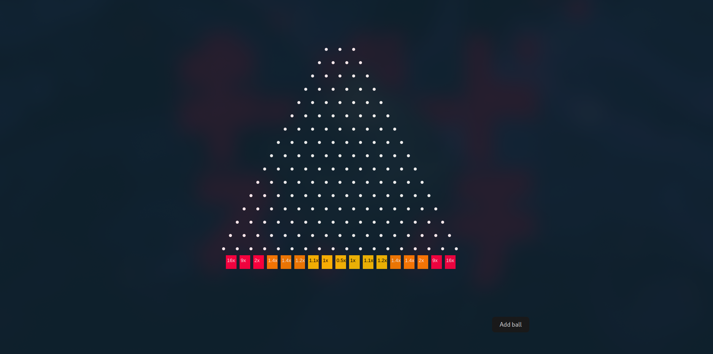

# Plinko Game Clone

This is a clone of the popular Plinko game found on Stake.com. Plinko is a fun and exciting game where players drop a ball from the top of a pegged board, and it bounces through a series of pegs before landing in one of several slots at the bottom. Each slot has a different reward, making each drop a thrilling experience.

## How Gambling Websites Make Money

Gambling websites like Stake.com profit from games like Plinko through the odds and payout structure. While each individual bet might seem to offer a fair chance of winning, the underlying probabilities are arranged to ensure that, over time, the house will always make a profit.

For example, if we analyze the probabilities and multipliers for a typical Plinko game:

- 0.0015 chance of winning 16x
- 0.0244 chance of winning 9x
- 0.18 chance of winning 2x
- 0.85 chance of winning 1.4x
- 2.777 chance of winning 1.4x
- 6.665 chance of winning 1.2x
- 12.219 chance of winning 1.1x
- 17.4561 chance of winning 1x
- 19.638 chance of winning 0.5x

If we sum the probabilities multiplied by their respective multipliers:

```
0.0015 * 16 + 0.0244 * 9 + 0.18 * 2 + 0.85 * 1.4 + 2.777 * 1.4 + 6.665 * 1.2 + 12.219 * 1.1 + 17.4561 * 1 + 19.638 * 0.5 = 98.8%
```

This totals 98.8%, meaning that for every $100 wagered, the expected return is $98.80. This results in a loss of $1.20 for the player on average.

## Client-Side and Server-Side Considerations

In these games, the processing cannot be done entirely on the client side because the client could potentially manipulate the code to ensure the ball always drops in the 16x slot. To prevent this, the critical game logic, including the determination of the ball's final landing spot, must be handled server-side.

However, performing physics, collision detection, and other intensive calculations on the server side is impractical due to the high CPU demand. Instead, the server calculates the outcome and sends a predetermined array of steps (left or right) and a starting point to the client. This way, the client can simulate the ball drop, showing realistic physics while ensuring the result is as calculated by the server.

The client browser handles the physics calculations and simulation to show the movement of the ball and its final position. This provides a responsive and interactive user experience without compromising the integrity of the game's outcome, which has already been determined by the server.

## Features

- Realistic physics for ball bouncing
- Multiple reward slots with customizable rewards
- Easy to understand UI

## Installation

### Frontend (Vite + React)

To get started with the frontend of the Plinko game clone using Vite and React, follow these steps:

1. Clone the repository:
    ```bash
    git clone https://github.com/yourusername/plinko-game-clone.git
    ```

2. Navigate to the project directory:
    ```bash
    cd plinko-game-clone
    ```

3. Install the necessary dependencies:
    ```bash
    npm install
    ```

4. Start the development server:
    ```bash
    npm run dev
    ```

   This will start the frontend server at `http://localhost:5173`.

### Backend

If your project includes a backend server component, follow these additional steps:

1. Navigate to the backend directory:
    ```bash
    cd backend
    ```

2. Install the necessary dependencies:
    ```bash
    npm install
    ```

3. Start the backend development server:
    ```bash
    npm run dev
    ```

   This will start the backend server at `http://localhost:3000`.

## Usage

Once both frontend and backend servers are running:

- Open your browser and navigate to `http://localhost:5173` to start playing the game.
- Interact with the game by clicking on the top of the grid to drop a ball.
- Watch the ball bounce through the pegs and land in a slot.
- Check your rewards based on where the ball lands.

## Screenshots

(
